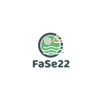

<p align="center">

</p>

[](https://github.com/FaSe22/Just-Another-Boring-TodoApp/actions/workflows/phpcsfixer.yml)
[

## About this App

This is just another Todo App. 
Im practising Laravel and TDD with it. 


## Installation

1. Clone the repository
````bash
git clone git@github.com:FaSe22/Just-Another-Boring-TodoApp.git
````

2. If you have Docker installed run 

````bash
sail up
````

3. Run the migrations
````bash
sail artisan migrate
````

4. Serve the project with

````bash
sail artisan serve
````

## Run tests

`````bash
sail artisan test
`````

## Functionality

The app works for individual users and for teams.

Users can view their own statistics and have full permissions in their own space.
As a user you can write, edit and delete your own Tasks.

If you are the administrator of a team you can assign permissions to team member.
Tasks can be assigned to other users in your team.


## Technical Details

The permission system I use is [ACL](https://mateusjunges.github.io/laravel-acl)
